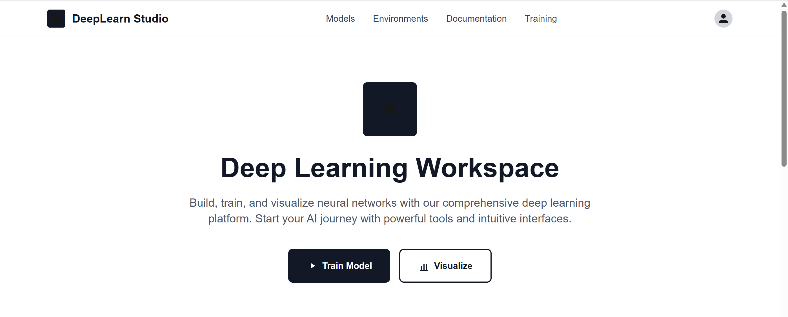
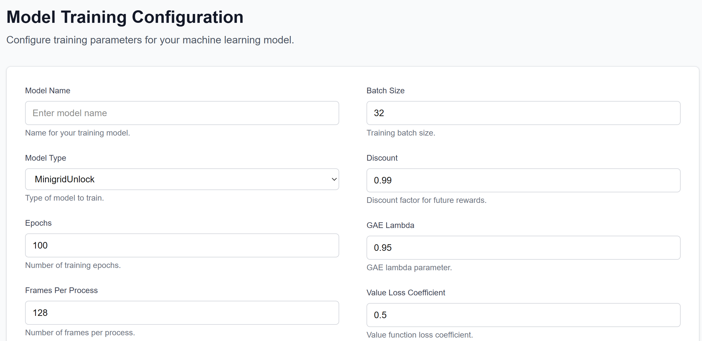
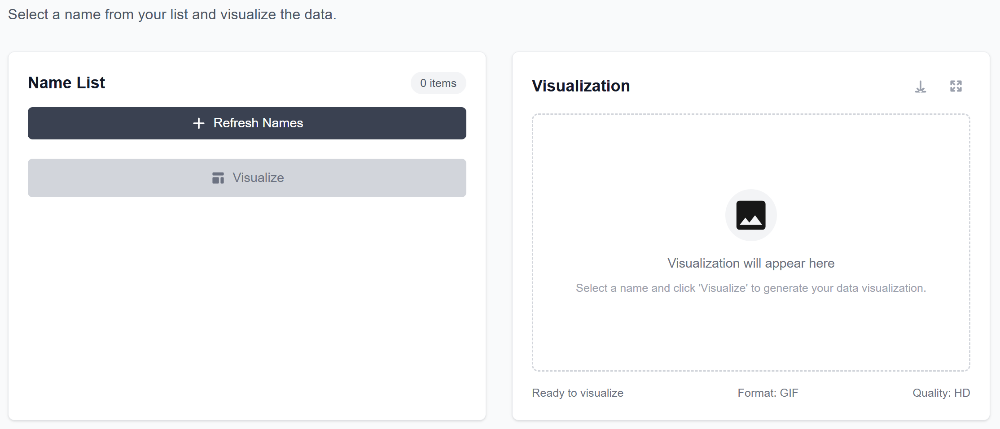

# OpenAI Agents – Training & Visualization

## Overview
A full-stack project for **training, running, and visualizing OpenAI Agents** to analyze their behavior, reasoning flow, and outputs under different prompts and configurations.

Built to demonstrate practical understanding of **agentic systems**, observability, and experimentation.

---

## Features
- Execute and train OpenAI Agents
- Observe reasoning and decision-making behavior
- Separate backend (agent logic) and frontend (visualization)

---

## Screenshots

### Main View

### Training Process

### Behavior Visualization

